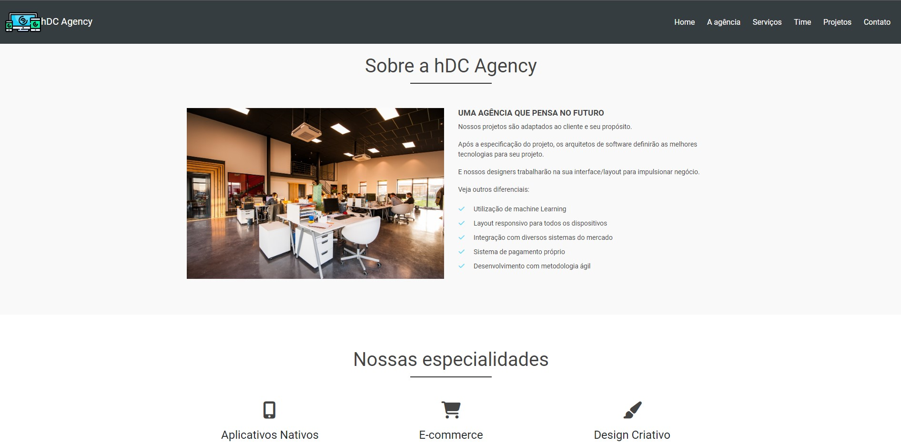

# hDC Agency Page

> Projeto feito no curso de Bootstrap do Matheus Battisti, utilizando a versão 4 do Bootstrap juntamente com Jquery.

## Índice

- [Imagem do projeto](#imagem-do-projeto)
- [Sobre o Projeto](#sobre-o-projeto)
- [Tecnologias](#tecnologias-💻)
- [Contato](#contato)

## Imagem do Projeto

## Sobre o Projeto

O projeto visou criar uma landing page completa (totalmente responsiva para os principais tamanhos de tela) de uma Agência fictícia, focando no uso do Bootstrap na sua versão 4.

Embora o Bootstrap tenha sido utilizado para o intuíto de aprendizado, muitas coisas foram alteradas com o CSS para deixar com o visual mais agradável, deixando o projeto mais personalizado.

Foi utilizado também o Jquery para fazer efeitos como **Parallax** em fotos, **Scroll Bar progressiva** em círculos com dados, **Scroll animado** no menu de navegação, entre outros.

A página é totalmente responsiva para os principais tamanhos de tela: Smartphone (até 425px), Tablet (até 768px) e Desktop (acima de 768px).

## Tecnologias 💻

- HTML
- CSS
- Bootstrap
- Javascript
- Jquery

## Contato

📩 alysson_leite@yahoo.com.br

🔗 [Linkedin](https://www.linkedin.com/in/alysson-leite-14040a239/)

